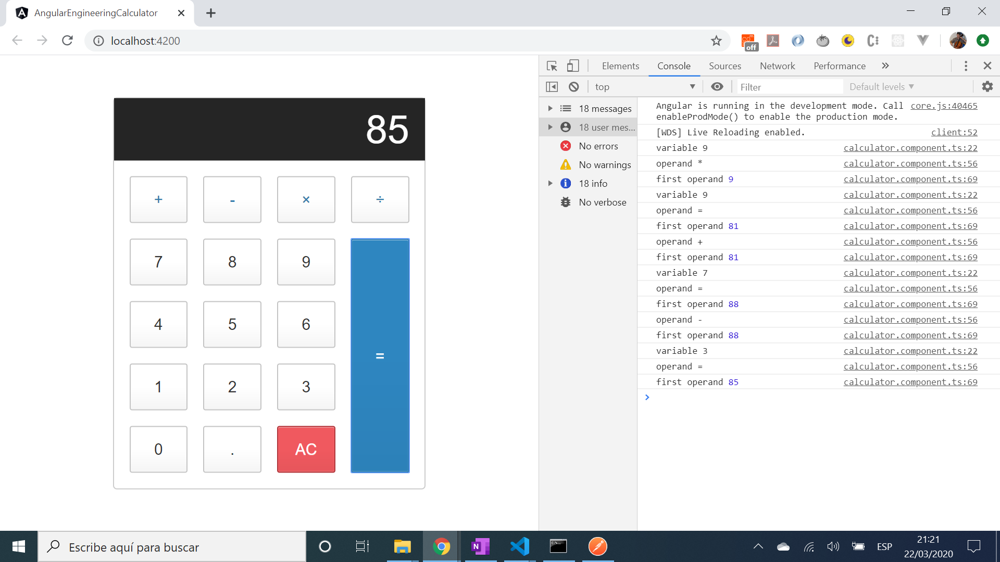

# :zap: Angular Engineering Calculator

* App to do simple arithmetic calculations.
* Tutorial code from [Ahmed Bouchefra, TechieDiaries: Angular 9 Tutorial and Example: Build your First Angular App](https://www.techiediaries.com/angular/angular-9-tutorial-and-example/) to be expanded into a more complex calculator with Engineering functions.

*** Note: to open web links in a new window use: _ctrl+click on link_**

## :page_facing_up: Table of contents

* [:zap: Angular Engineering Calculator](#zap-angular-engineering-calculator)
  * [:page_facing_up: Table of contents](#page_facing_up-table-of-contents)
  * [:books: General info](#books-general-info)
  * [:camera: Screenshots](#camera-screenshots)
  * [:signal_strength: Technologies](#signal_strength-technologies)
  * [:floppy_disk: Setup](#floppy_disk-setup)
  * [:computer: Code Examples](#computer-code-examples)
  * [:cool: Features](#cool-features)
  * [:clipboard: Status & To-Do List](#clipboard-status--to-do-list)
  * [:clap: Inspiration](#clap-inspiration)
  * [:envelope: Contact](#envelope-contact)

## :books: General info

* Calculator created in HTML and CSS, using html from a [jsfiddle by Ayo Isaiah](http://jsfiddle.net/ayoisaiah/c8b9zsaq/)

## :camera: Screenshots



## :signal_strength: Technologies

* [Angular v10](https://angular.io/)

## :floppy_disk: Setup

* Install dependencies using `npm i`
* Run `ng serve` to get a server at `http://localhost:4200/`
* If required, run `ng build` to build the project. The build artifacts will be stored in the `docs` directory. Use the `--prod` flag for a production build.

## :computer: Code Examples

* Switch statement used to return the result of different operations depending on the operand used

```typescript
  private doCalculation(op: any, secondOp: any) {
    switch (op) {
      case '+':
        return this.firstOperand += secondOp;
      case '-':
        return this.firstOperand -= secondOp;
      case '*':
        return this.firstOperand *= secondOp;
      case '/':
        return this.firstOperand /= secondOp;
      case '=':
        return secondOp;
    }
  }
```

## :cool: Features

* Angular event binding used to bind the `getNumber()` method to the button `(click)` DOM event

## :clipboard: Status & To-Do List

* Status: Working
* To-Do: Add engineering functions

## :clap: Inspiration

[Ahmed Bouchefra, TechieDiaries: Angular 9 Tutorial and Example: Build your First Angular App](https://www.techiediaries.com/angular/angular-9-tutorial-and-example/),

## :envelope: Contact

* Repo created by [ABateman](https://www.andrewbateman.org) - you are welcome to [send me a message](https://andrewbateman.org/contact)
